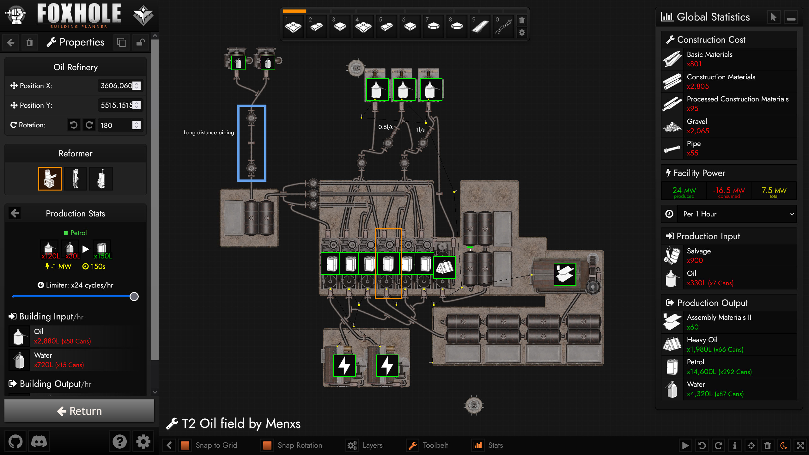

# Foxhole Planner

Create blueprints for a bunker, facility, and more using this fan-made tool for the video game Foxhole. Formerly known as Foxhole Facility Planner, this tool now features facilities, bunkers, trenches, and more!

Access the tool at: https://foxholeplanner.com

## Features

- **Blueprint Editor**
    - Project Loading & Saving
    - Multi-Selection, Label, Rectangle, Circle, & Line Tool
    - Auto-Saving with History and Undo / Redo Actions
    - Facility, Bunker, and Trench Construction
    - Pipe and Power Line Construction
    - Rail and Road Construction
- **Building Browser**
    - Community-Made Presets and Showcase
    - Category, Faction, and Tier Filtering
    - Production Recipes Overview
    - Building Properties with Upgrades and Production Selection
- **Statistics**
    - Total Construction Cost
    - Bunker Health, Repair Cost, and Structural Integrity
    - Production Limits & Time Filtering
    - Maintenance Supply Consumption
    - Facility Power and Resource Production Input / Output

## Tool Preview




## Project Authors / Maintainers

- **Brandon Ray** ([@brandon-ray](https://github.com/brandon-ray))
- **James Cunningham** ([@jimdcunningham](https://github.com/jimdcunningham))

## Special Thanks
- **Siege Camp**: Allowing us to continue working on this project and featuring us on Foxhole's website. 🧡
- **Romboter**: Actively helping our community grow and giving some great early tips about Foxhole's data.
- **[22-ACR] Justin**: Exporting images for all the structures from the game. Seriously, amazing work.

## Community Appreciation
The future for the planner is incredibly promising. Thank you to everyone who's been giving suggestions, sharing plans, and actively been a part of this journey with us. We've had an overwhelming amount of positive feedback and look forward to our future together. We've loved hearing from everyone. 🧡

## Run Locally

Clone the project

```bash
  git clone https://github.com/brandon-ray/foxhole-facility-planner
```

Go to the project directory

```bash
  cd foxhole-facility-planner
```

Install dependencies

```bash
  npm install
```

Start the server

```bash
  node app.js
```

Go to http://localhost:3000/ in your browser
## Support & Feedback

If you need help or have any feedback, join our [Discord](https://discord.gg/2hgaMQN26s) or e-mail us.
- **Brandon (Rayboy)**: brandon@bombsightgames.com

Made with ❤️ using [Vue.js](https://vuejs.org/) and [PixiJS](https://pixijs.com/)
