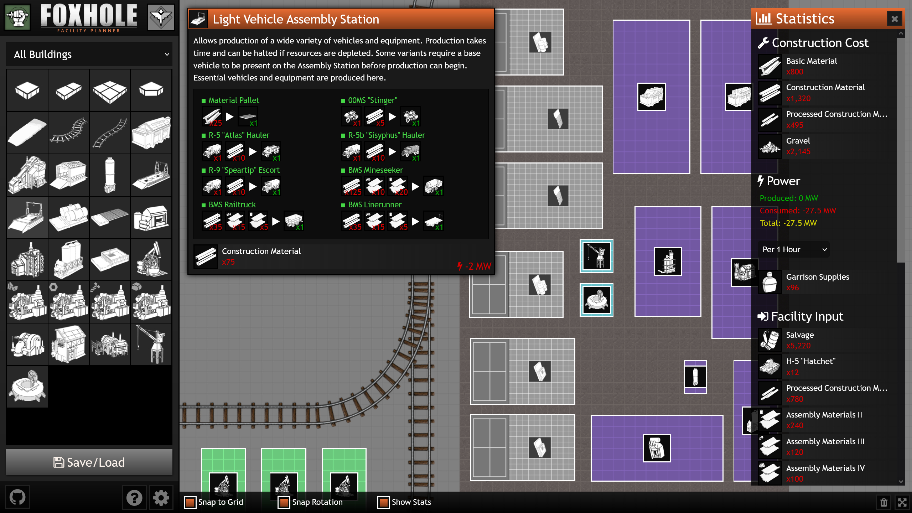

# Foxhole Facility Planner

This tool allows you to draw up plans for facilities from Foxhole's new Inferno update. It takes power and resource needs into account to help you efficiently design your facilities. You can save your plans to be loaded later and share them with fellow members of your regiment!

Made with ❤️ by the PEG Regiment using Vue.js and Pixi.js
## Features

- **Facility Blueprint Editor**
    - Saving and Loading
    - *Mostly* Accurate Building Placement ;)
    - Rail and Road Construction
- **Building Browser**
    - Category and Faction Filtering
    - Production Recipes Overview
    - Building Properties
    - Upgrade and Production Selection
- **Facility Statistics**
    - Total Construction Cost
    - Power and Garrison Supply Consumption
    - Facility Resource Input and Production Output
    - Production Time Filtering
## Screenshots




## Live Website (Latest Release)

https://foxholeplanner.com


## Authors

- [@brandon-ray](https://github.com/brandon-ray)
- [@jimdcunningham](https://github.com/jimdcunningham)

## Potential Future Features 
***Note:** These are things we might add in the future.*

- **Facility Image Export:** Save an image of your facility locally.
- **Statistics CSV Export:** Save your Facility stats to a spreadsheet.
- **Pipe & Power Line Construction** (Building Connection Points)
- **Selection Tool:** Select and manipulate multiple objects at once.
    - **Moving, Rotation, Copy & Paste, Deletion, etc.**
- **Redo & Undo:** Revert mistakes and boo-boos.
## Run Locally

Clone the project

```bash
  git clone https://github.com/brandon-ray/foxhole-facility-planner
```

Go to the project directory

```bash
  cd foxhole-facility-planner
```

Install dependencies

```bash
  npm install
```

Start the server

```bash
  node app.js
```

Go to http://localhost:3000/ in your browser
## Support & Feedback

If you need help or have any feedback, e-mail brandon@bombsightgames.com